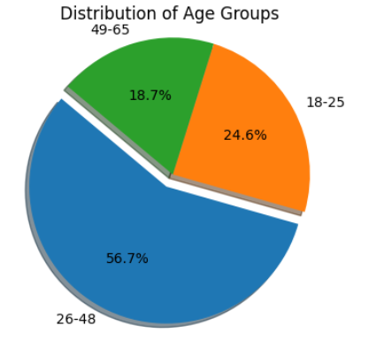
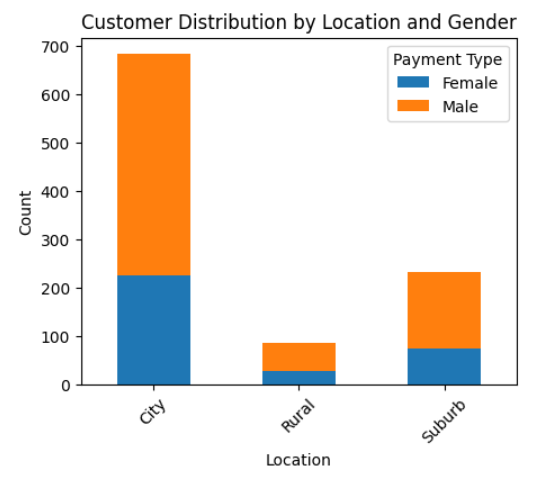

# AtliQo Bank - Credit Card Target Market Analysis (Phase 1)

This repository contains a data analysis project focused on identifying a target market for a new credit card launch for AtliQo Bank. The analysis uses customer demographic data, transaction history, and credit profile information to define an "untapped market" segment.

## Objective

To analyze customer transaction data and credit profiles to identify a high-potential target group for the launch of a new AtliQo Bank credit card.

## Datasets Used

This analysis merges and analyzes data from three primary sources:
* `customers.csv`: Demographic information such as age, location, occupation, and annual income.
* `transactions.csv`: Customer transaction history, including platform, product category, and payment type.
* `credit_profiles.csv`: Financial profile data, including credit score, credit utilization, outstanding debt, and credit limit.
* `E_MasterCardDump.sql`: The original SQL database dump from which the CSV data was likely extracted.

## Analysis & Key Findings

The analysis involved merging these datasets to build a complete customer profile. By analyzing spending habits (e.g., payment types, top shopping categories) against demographic data (e.g., age, income, location), a key target segment was identified.

**Conclusion:** The finalized target market for the trial credit card launch is the **18-25 age group**.

**Reasoning for this segment:**
* This group represents a significant portion of the customer base (~26%).
* They currently have low credit history, low credit limits, and low credit card usage, indicating an "untapped market".
* Their primary spending categories are Electronics, Fashion & Apparel, and Beauty & Personal Care, which align well with credit card reward programs.

## Visual Highlights

Here are some key visualizations that support the analysis and target market identification:

**Transaction Count by Age Group and Product Category**
*(This chart illustrates the spending priorities of different age groups, highlighting key categories for young adults.)*



**Credit Limit Distribution for Young Adults (Age 18-25)**
*(This visualization shows the current credit limits for the identified target market, emphasizing their lower credit exposure and potential for growth.)*



## Technologies Used

* **Python**
* **Jupyter Notebook**
* **Pandas:** For data loading, manipulation, and merging.
* **NumPy:** For numerical operations.
* **Matplotlib & Seaborn:** For data visualization (e.t., histograms, bar charts) to analyze distributions and compare groups.

## How to Run This Project

1.  Clone the repository:
    ```bash
    git clone [your-repository-url]
    ```
2.  Install the required libraries:
    ```bash
    pip install pandas numpy seaborn matplotlib jupyterlab
    ```
3.  Ensure all `.csv` data files are in the same directory as the notebook.
4.  Run the `phase_1_atliqo_bank.ipynb` file using Jupyter Lab or Jupyter Notebook.
